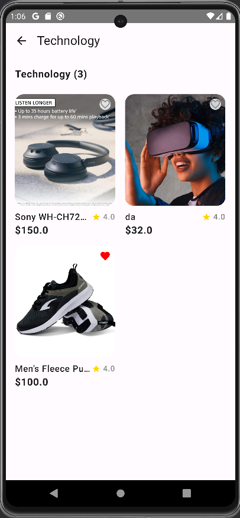
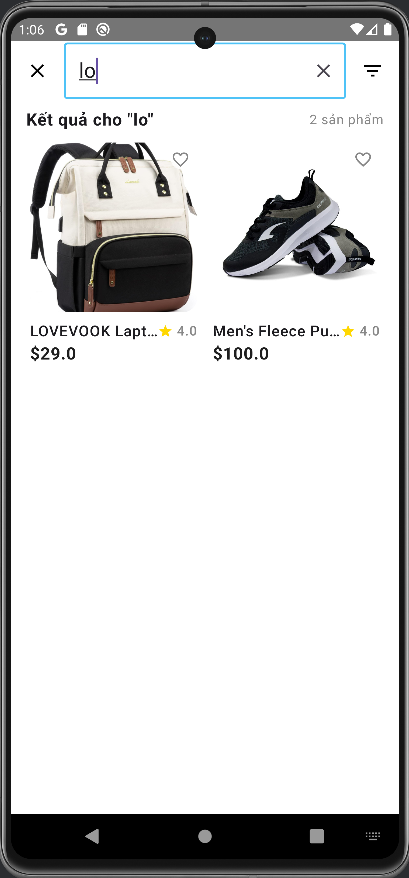
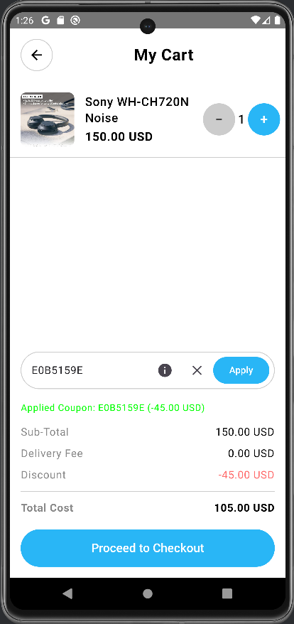
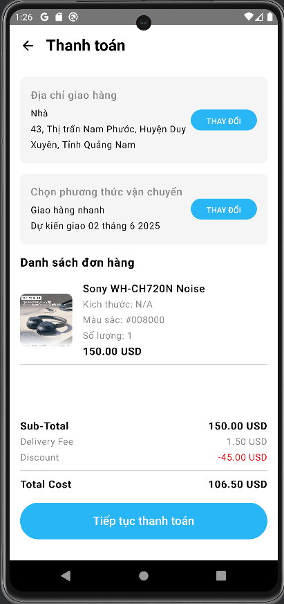
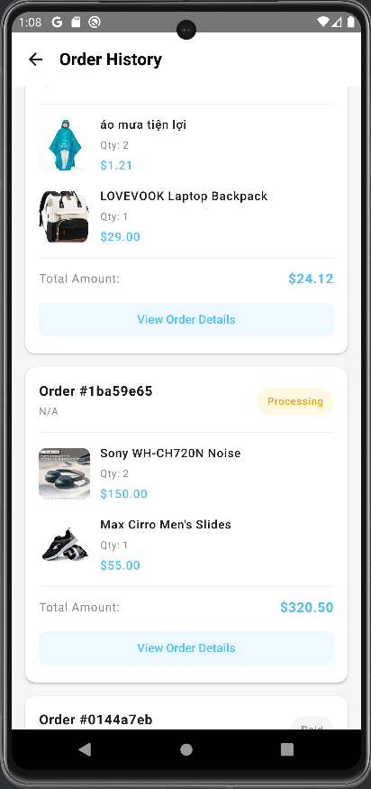

# 🛍️ Ứng Dụng Mua Sắm Trực Tuyến – Android

## 📱 Giới thiệu

Ứng dụng được phát triển bởi **Trung Hiếu**, sử dụng nền tảng **Android Kotlin**, kiến trúc **MVVM**, và thư viện hiện đại **Jetpack Compose**. Dự án mô phỏng hệ thống thương mại điện tử đơn giản, dễ sử dụng, phù hợp cho sinh viên hoặc người mới học Android.

---

## 🎯 Mục tiêu

- Xây dựng ứng dụng thương mại điện tử trên nền tảng Android.
- Hỗ trợ người dùng tìm kiếm, đặt mua, theo dõi và đánh giá sản phẩm.
- Cung cấp giao diện quản trị cho admin để quản lý sản phẩm và đơn hàng.

---

## ⚙️ Công nghệ sử dụng

- 🔹 **Ngôn ngữ:** Kotlin  
- 🔹 **Giao diện:** Jetpack Compose  
- 🔹 **Kiến trúc:** MVVM (Model - View - ViewModel)  
- 🔹 **Cơ sở dữ liệu:** Firebase Firestore  
- 🔹 **Xác thực người dùng:** Firebase Authentication  
- 🔹 **IDE:** Android Studio  
- 🔹 **Quản lý mã nguồn:** GitHub

---

## 🔑 Tính năng chính

### 👤 Dành cho người dùng
- Đăng ký / Đăng nhập
- Xem danh mục và chi tiết sản phẩm
- Tìm kiếm sản phẩm
- Thêm / Xóa sản phẩm khỏi giỏ hàng
- Thanh toán đơn hàng
- Theo dõi và xem lịch sử đơn hàng
- Đánh giá, nhận xét sản phẩm
- Lưu danh sách yêu thích

### 🛠️ Dành cho admin
- Thêm / Sửa / Xóa sản phẩm
- Quản lý đơn hàng và khuyến mãi

---

## 📷 Giao diện ứng dụng

### 🔐 Xác thực
| Đăng nhập | Đăng ký |
|-----------|---------|
|  |  |

### 🏠 Trang chính
| Trang chủ | Danh mục | Tìm kiếm |
|-----------|----------|----------|
|  |  |  |

### 🛒 Mua sắm
| Chi tiết sản phẩm | Giỏ hàng | Thanh toán | Lịch sử mua hàng |
|-------------------|----------|------------|------------------|
|  |  |  |  |

---

## ✅ Kết quả đạt được

- Hoàn thiện đầy đủ chức năng mua sắm cơ bản.
- Giao diện đơn giản, trực quan.
- Ứng dụng Firebase hiệu quả cho xác thực và lưu trữ dữ liệu.
- Có tính hợp thanh toán bằng PayPal.
- Đánh giá sản phẩm.

---

## 🚀 Hướng phát triển

- Cải tiến giao diện người dùng (UI/UX)
- Tối ưu hóa hiệu suất tải dữ liệu
- Tích hợp các cổng thanh toán nội địa như ZaloPay, MoMo
- Hỗ trợ phiên bản đa nền tảng 

